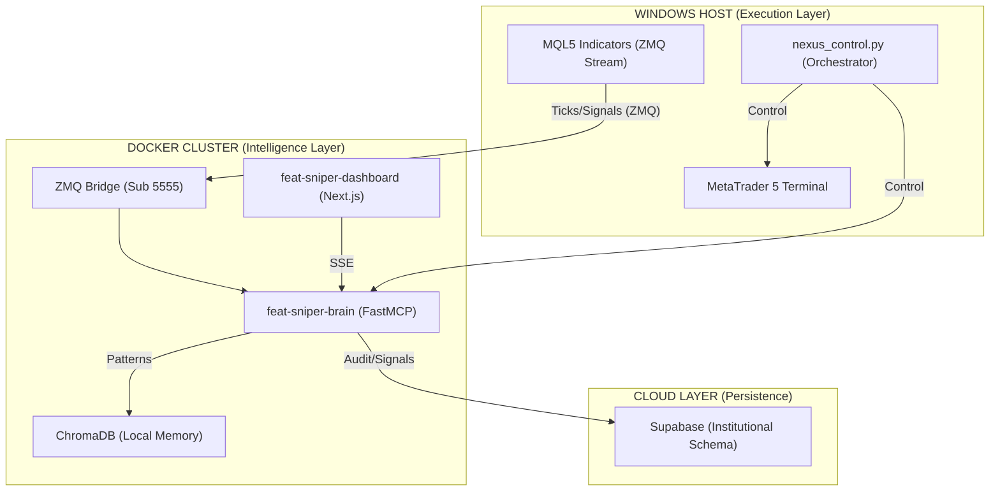

# 🏗️ FEAT NEXUS PRIME Architecture

## Overview

FEAT NEXUS PRIME is an institutional-grade algorithmic trading architecture designed to decouple the **Execution Layer** (MT5/Windows) from the **Intelligence Cluster** (Docker/Python). It features infinite memory (RAG), high-frequency persistence (Supabase), and unified lifecycle orchestration.

## 📡 System Topology



## 🔄 The 4-Pillar Lifecycle

### 1. The Bridge (MQL5 → ZMQ)
- `UnifiedModel_Main.mq5`: High-frequency feature extraction (FEAT metrics).
- `InstitutionalPVP.mq5`: Volume profile and liquidity analysis.
- **Protocol**: Raw ZMQ streaming on Port 5555.

### 2. The Brain (FastMCP Server)
- **Engine**: Python-based MCP server running in Docker.
- **RAG Memory**: Local persistence for narrative and pattern storage via ChromaDB.
- **Self-Healing**: Triggered by the Omni-Auditor for automated logic correction.

### 3. The Persistence (Supabase)
- **Tick Logging**: High-frequency capture into `market_ticks`.
- **Signal Audit**: End-to-end signal tracking in `feat_signals`.
- **Learning**: `ml_inference_logs` store input features for future model retraining.

### 4. The Orchestration (`nexus_control.py`)
- **Golden Start**: Sequential MT5 -> Docker -> Web boot.
- **War Room Report**: Pre-ignition system health summary.
- **Graceful Shutdown**: SIGINT handling for total system safety.

## 📂 Project Structure

```
feat_sniper_mcp/
├── app/                          # Distributed Logic
│   ├── core/                     # Infrastructure (ZMQ, SSE)
│   ├── skills/                   # MCP Tools (Market, Execution, ML)
│   ├── services/                 # Persistence (Supabase, ChromaDB)
│   └── ml/                       # Local Training & Models
│
├── FEAT_Sniper_Master_Core/      # MQL5 Physics
│   ├── UnifiedModel_Main.mq5     # Main Extraction Logic
│   └── Include/                  # CFEAT, CFSM, CLiquidity
│
├── nexus_control.py              # SYSTEM ORCHESTRATOR
├── nexus.bat                     # Main Ignition Switch
├── stop_nexus.bat                # Emergency Stop
├── nexus_auditor.py              # Omni-System Auditor
└── dashboard/                    # Visual Cockpit (Next.js)
```

## 🌐 Connectivity & Security
- **ZMQ Bridge**: Port 5555 (Encrypted via SSH if remote).
- **FastMCP API**: Port 8000 (SSE Transport).
- **Dashboard**: Port 3000.
- **Supabase**: RLS (Row Level Security) enabled on all institutional tables.

---
*Senior Architecture Document | MT5 Neural Sentinel | v2.25*
