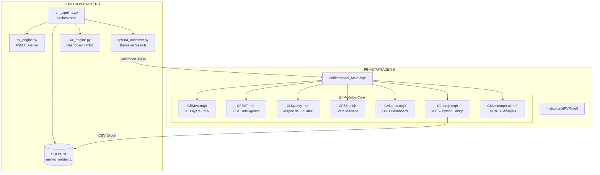
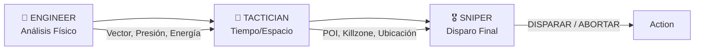
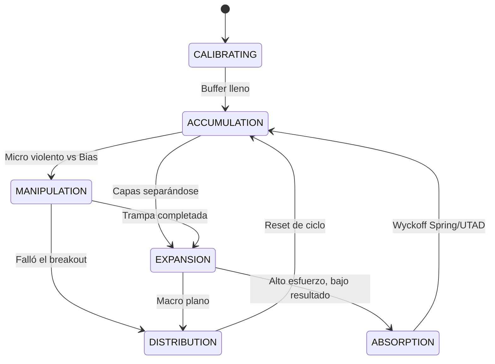

# 🎯 FEAT_Sniper_Master_Core - Visión Global del Sistema

> **Sistema Cuántico de Trading Institucional**  
> *Análisis Multifractal con Inteligencia Artificial*

---

## 🧭 Propósito Estratégico

**FEAT_Sniper_Master_Core** es un sistema de análisis institucional de alta precisión para MetaTrader 5, diseñado para identificar oportunidades de trading con la precisión de un "francotirador" institucional. El sistema combina:

1. **Análisis Multifractal de 31 Capas EMA** - Motor de comprensión de tendencias a múltiples escalas temporales
2. **Detección de Liquidez Institucional** - Mapeo de zonas de acumulación/distribución
3. **Máquina de Estados Finitos (FSM)** - Clasificación inteligente del estado del mercado
4. **Pipeline de Machine Learning** - Optimización automática de umbrales con Bayesian Search
5. **Interoperabilidad MT5⟷Python** - Bridge para entrenamiento y calibración

---

## 🏛️ Arquitectura de Alto Nivel



---

## 🎪 Metáfora del Sistema: "El Mercado como Física de Fluidos"

El sistema utiliza una **metáfora física** para interpretar el comportamiento del precio:

| Capa EMA | Metáfora | Color | Períodos | Comportamiento |
|----------|----------|-------|----------|----------------|
| **MICRO** | 🌬️ Gas/Viento | Rojo/Amarillo | 1-12 | Volátil, reactivo, ruido |
| **OPERATIONAL** | 🌊 Agua/Río | Naranja | 16-224 | Flujo operativo, rebotes |
| **STRUCTURAL** | 🧱 Muro/Pared | Verde | 50+ | Soporte/resistencia fuerte |
| **MACRO** | 📍 Magneto | Azul | 256-1280 | Atracción a largo plazo |
| **BIAS** | ⚖️ Régimen | Gris | 2048 | Tendencia dominante absoluta |

---

## 🧠 Flujo de Decisión: Ingeniero → Táctico → Francotirador

El sistema implementa una **cadena de comando militar** para la toma de decisiones:



### Roles Definidos:

1. **🔧 Ingeniero Cuántico (SEngineerReport)**
   - Analiza vectores de fuerza (trend bullish/bearish)
   - Detecta presión (alta/baja)
   - Mapea trayectoria crítica (A → B)
   - Evalúa estado de energía (compresión vs expansión)

2. **🎯 Táctico (STacticianReport)**
   - Valida horario operable (killzones)
   - Detecta POI (FVG, OB, ZS)
   - Evalúa ubicación relativa (premium/discount)
   - Genera acción: `BUSCAR_GATILLO` o `ESPERAR`

3. **🎖️ Francotirador (SSniperReport)**
   - Decisión final: `DISPARAR` o `ABORTAR`
   - Calcula Entry/SL/TP con precisión
   - Confianza porcentual (0-100%)
   - Genera orden ejecutable

---

## 📊 Estados del Mercado (FSM)



---

## 🗂️ Estructura de Documentación

Esta documentación está organizada en archivos modulares:

| Archivo | Contenido |
|---------|-----------|
| `00_VISION_GLOBAL.md` | Este archivo - Visión general del sistema |
| `01_MQL5_CORE.md` | Arquitectura y módulos MQL5 |
| `02_CFEAT_INTELLIGENCE.md` | Sistema FEAT de inteligencia de mercado |
| `03_LIQUIDITY_MAPPING.md` | Detección de liquidez institucional |
| `04_FSM_STATES.md` | Máquina de estados y clasificación |
| `05_PYTHON_PIPELINE.md` | Backend Python y ML |
| `06_INTEROPERABILITY.md` | Bridge MT5↔Python |
| `07_VISUAL_HUD.md` | Dashboard y visualización |
| `08_ROADMAP.md` | Roadmap y objetivos a largo plazo |

---

## 🚀 Quick Start para Agentes

### Para Agente de Desarrollo:
```bash
# El entry point principal es:
UnifiedModel_Main.mq5

# Los módulos incluidos están en:
Include/UnifiedModel/*.mqh
```

### Para Agente de ML/Data:
```bash
# Pipeline de datos:
cd Python/
python run_pipeline.py --input mock_data.csv --symbol EURUSD --tf H1
```

### Para Agente de Despliegue:
```bash
# Compilar indicador:
# En MetaEditor: Compile UnifiedModel_Main.mq5

# Los archivos .ex5 son los binarios compilados
```

---

## 📝 Notas para Agentes de IA

> [!IMPORTANT]
> Este sistema está diseñado para ser **no-ejecutivo** (solo indicador).
> El disparo final de órdenes debe ser confirmado por humano o por un EA separado.

> [!TIP]
> La calibración óptima de umbrales viene del pipeline Optuna.
> Ver `Python/optuna_calibration.json` para valores optimizados.

---

*Última actualización: January 2026*
*Versión: Master Core 2.0*
