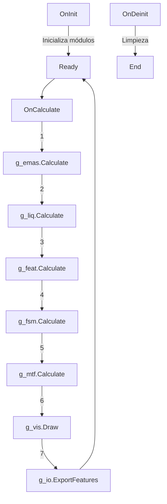
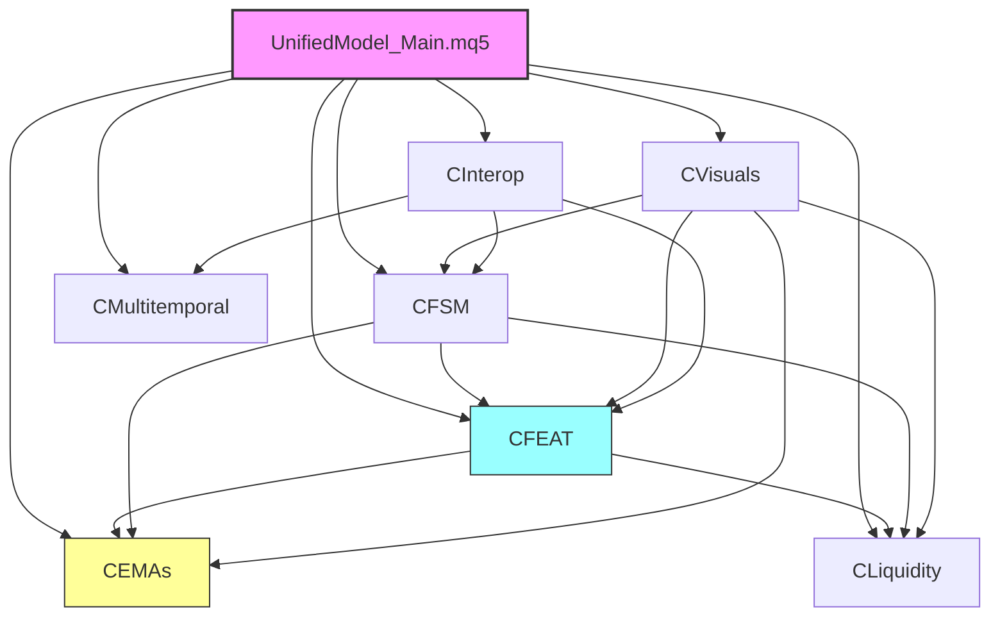

# 📦 Arquitectura MQL5 Core

> **Motor de Análisis Institucional en MetaTrader 5**

---

## 🗂️ Estructura de Archivos

```
FEAT_Sniper_Master_Core/
├── UnifiedModel_Main.mq5          # 🎯 Indicador principal
├── UnifiedModel_Full.mq5          # 📦 Versión expandida (legacy)
├── InstitutionalPVP.mq5           # 📊 Volume Profile Indicator
│
└── Include/UnifiedModel/
    ├── CEMAs.mqh                  # 🔢 Motor de 31 EMAs multifractal
    ├── CFEAT.mqh                  # 🧠 Inteligencia FEAT (Engineer/Tactician/Sniper)
    ├── CLiquidity.mqh             # 💧 Mapeo de liquidez institucional
    ├── CFSM.mqh                   # ⚙️ Máquina de estados finitos
    ├── CVisuals.mqh               # 🎨 HUD Dashboard visual
    ├── CInterop.mqh               # 🔗 Bridge MT5↔Python
    └── CMultitemporal.mqh         # 📈 Análisis multi-timeframe
```

---

## 🎯 UnifiedModel_Main.mq5 - Entry Point Principal

### Propósito
Indicador principal que orquesta todos los módulos y renderiza 31 líneas EMA en el chart con un HUD de inteligencia.

### Propiedades del Indicador
```mql5
#property indicator_buffers 31        // 31 EMAs visualizables
#property indicator_plots   31

// Grupos visuales por color:
// - MICRO (1-12):      Rojo → Amarillo
// - OPERATIONAL (16-224): Naranja
// - STRUCTURAL (50+):   Verde
// - MACRO (256-1280):  Azul
// - BIAS (2048):       Gris
```

### Inputs Configurables
| Input | Tipo | Default | Descripción |
|-------|------|---------|-------------|
| `ATR_Period` | int | 14 | Período para normalización ATR |
| `Lookback` | int | 100 | Barras de lookback para análisis |
| `ShowDashboard` | bool | true | Toggle del HUD visual |
| `ExportData` | bool | true | Exportar datos a CSV para Python |

### Instancias Globales
```mql5
CEMAs       g_emas;      // Motor de EMAs
CFEAT       g_feat;      // Inteligencia FEAT
CLiquidity  g_liq;       // Mapeo de liquidez
CFSM        g_fsm;       // Clasificador de estados
CVisuals    g_vis;       // Dashboard visual
CInterop    g_io;        // Bridge Python
CMultitemporal g_mtf;    // Multi-timeframe
```

### Ciclo de Vida


---

## 🔢 CEMAs.mqh - Motor Multifractal de 31 Capas

### Constantes Clave
```mql5
#define EMA_COUNT       31
#define EMA_IDX_WIND    4   // Gas/Viento (período 6)
#define EMA_IDX_RIVER   10  // Río (período 32)
#define EMA_IDX_WALL    14  // Muro (período 50)
```

### Estructura de Datos por EMA
```mql5
struct SEMAData {
   int      period;       // Período de la EMA
   double   value;        // Valor actual
   double   prevValue;    // Valor anterior
   double   slope;        // Pendiente normalizada por ATR
   double   distance;     // Distancia al precio normalizada
   ENUM_EMA_GROUP group;  // Clasificación de grupo
};
```

### Grupos y Períodos

| Grupo | Índices | Períodos | Uso |
|-------|---------|----------|-----|
| **MICRO** | 0-9 | 1,2,3,4,6,8,10,12,14,16 | Ruido/señales rápidas |
| **OPERATIONAL** | 10-19 | 18-224 | Zona operativa principal |
| **MACRO** | 20-29 | 256-1280 | Tendencia de largo plazo |
| **BIAS** | 30 | 2048 | Régimen absoluto |

### Métricas de Fan (Abanico)
```mql5
struct SFanMetrics {
   double   totalSpread;      // Distancia total del abanico
   double   compression;      // 0=máxima expansión, 1=máxima compresión
   double   openingSpeed;     // Velocidad de apertura/cierre
   string   alignment;        // "BULLISH", "BEARISH", "MIXED"
   double   curvature;        // Curvatura promedio del abanico
};
```

### API Pública Principal
```mql5
bool Init(string symbol, ENUM_TIMEFRAMES tf, int atrPeriod = 14);
bool Calculate(int shift = 0);

// Getters de capas core
double GetWind();     // Micro (Gas)
double GetRiver();    // Operational (Agua)
double GetWall();     // Structural (Muro)

// Getters de métricas
SFanMetrics GetFanMetrics();
SEMAGroupMetrics GetMicroMetrics();
SEMAGroupMetrics GetOperationalMetrics();
SEMAGroupMetrics GetMacroMetrics();

// Posición del precio
double GetPricePosition(double price);  // -1 a 1 (debajo a encima del abanico)
```

---

## 📊 InstitutionalPVP.mq5 - Volume Profile Institucional

### Propósito
Indicador complementario para análisis de perfil de volumen con detección de:
- **POC** (Point of Control)
- **VAH/VAL** (Value Area High/Low)
- **HVN/LVN** (High/Low Volume Nodes)

### Estados del Mercado (Simplificado)
```mql5
enum ENUM_PVP_STATE {
   STATE_ACCUMULATION,   // Acumulación (rango lateral)
   STATE_DISTRIBUTION,   // Distribución (toma de ganancias)
   STATE_MARKUP,         // Markup (tendencia alcista)
   STATE_MARKDOWN        // Markdown (tendencia bajista)
};
```

### Formas de Perfil
```mql5
enum ENUM_PROFILE_SHAPE {
   SHAPE_P,              // P-Shape (Buy Pressure)
   SHAPE_b,              // b-Shape (Sell Pressure)
   SHAPE_B,              // B-Shape (Balance)
   SHAPE_D,              // D-Shape (Strong distribution)
   SHAPE_UNDEFINED       // Sin definir
};
```

### Killzones Configurables
| Killzone | Default Start | Default End |
|----------|---------------|-------------|
| London Open | 08:00 | 10:00 |
| NY Open | 13:00 | 15:00 |

---

## 🔗 Dependencias entre Módulos



---

## ⚠️ Consideraciones de Compilación

> [!WARNING]
> El orden de includes es crítico. `CFEAT.mqh` debe incluirse después de `CEMAs.mqh` y `CLiquidity.mqh`.

### Orden Correcto de Includes
```mql5
#include <UnifiedModel\CEMAs.mqh>
#include <UnifiedModel\CLiquidity.mqh>
#include <UnifiedModel\CFEAT.mqh>        // Depende de CEMAs y CLiquidity
#include <UnifiedModel\CFSM.mqh>         // Depende de todos los anteriores
#include <UnifiedModel\CVisuals.mqh>
#include <UnifiedModel\CInterop.mqh>
#include <UnifiedModel\CMultitemporal.mqh>
```

---

## 📝 Notas para Desarrollo

> [!TIP]
> Para debugging, usa el parámetro `ShowDashboard=true` para ver el HUD en vivo.
> El archivo `compile.log` contiene warnings y errores de la última compilación.

> [!NOTE]
> Los archivos `.ex5` son binarios compilados. Solo el archivo `.mq5/.mqh` es editable.

---

*Módulo: MQL5 Core*
*Versión: 2.0*
