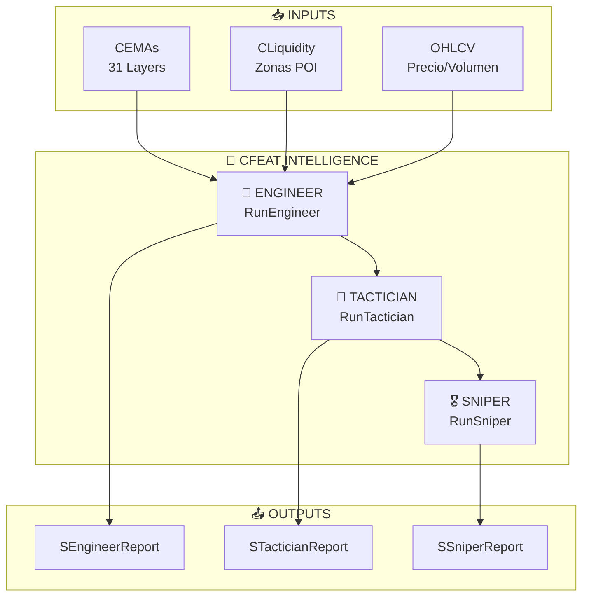
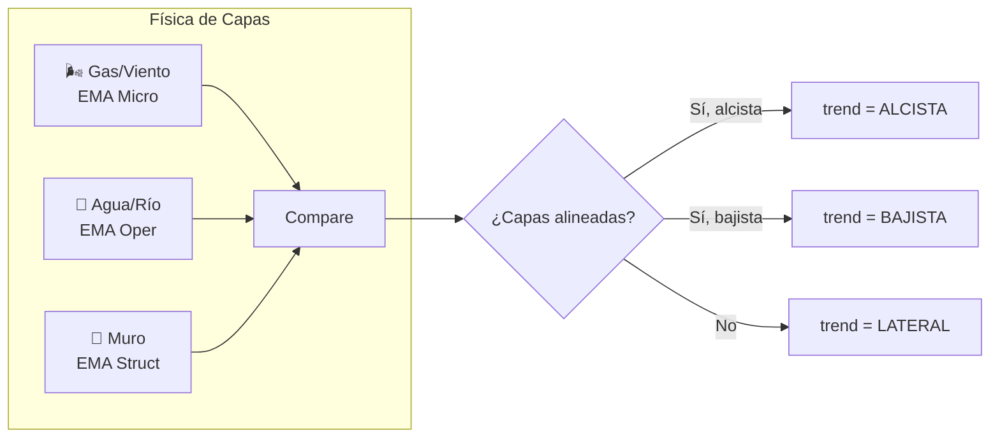
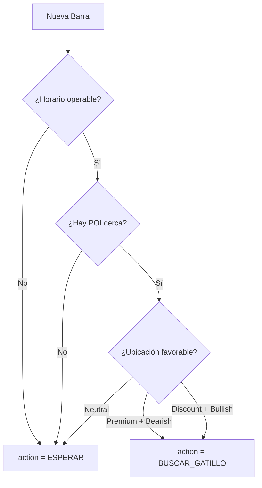

# 🧠 CFEAT Intelligence System

> **Framework de Extracción y Análisis de Tendencias Financieras**  
> *Engineer → Tactician → Sniper Decision Chain*

---

## 🎯 Propósito

`CFEAT.mqh` es el **cerebro analítico** del sistema. Implementa una cadena de mando de tres niveles que transforma datos crudos del mercado en decisiones de trading ejecutables.

---

## 🏛️ Arquitectura de Roles



---

## 🔧 Nivel 1: Ingeniero Cuántico (SEngineerReport)

### Responsabilidad
Analiza el mercado desde una perspectiva **física y dinámica**. Interpreta las fuerzas vectoriales y la energía del sistema.

### Estructura de Datos
```mql5
struct SEngineerReport {
   // Vectores de Fuerza
   string    trend;              // "ALCISTA", "BAJISTA", "LATERAL"
   string    pressure;           // "ALTA PRESION", "FRICCION", "FLUJO LIBRE"
   
   // Estado Energético
   string    energyState;        // "COMPRESION (SQZ)" vs "EXPANSION (ABANICO)"
   double    compressionRatio;   // 0.0 (expandido) a 1.0 (comprimido)
   
   // Trayectoria Crítica
   double    targetPrice;        // Próximo objetivo calculado
   string    criticalPath;       // "1.08500 -> FVG_M5 (1.09200)"
   
   // Indicadores Técnicos
   string    rsiState;           // "SOBRE-COMPRA", "NEUTRO", "SOBRE-VENTA", "CRITICO"
   
   // Diagnóstico y Orden
   string    diagnosis;          // Explicación narrativa
   string    engineerOrder;      // "COMPRAR EN PULLBACK", "VENDER EN PULLBACK", "OBSERVAR"
};
```

### Lógica de Análisis



### Reglas de Diagnóstico

| Condición | Presión | Diagnóstico |
|-----------|---------|-------------|
| RSI > 80 + Compresión alta | ALTA PRESION | "Posible agotamiento alcista" |
| RSI < 20 + Compresión alta | ALTA PRESION | "Posible spring de Wyckoff" |
| Capas separándose | FLUJO LIBRE | "Expansión en curso. Buscar continuación" |
| Capas convergiendo | FRICCION | "Acumulación de energía. No operar ruido" |

---

## 🎯 Nivel 2: Táctico (STacticianReport)

### Responsabilidad
Evalúa el **contexto de tiempo y espacio** para determinar si es momento de buscar una entrada.

### Estructura de Datos
```mql5
struct STacticianReport {
   // TIEMPO
   string               currentTime;      // "08:45"
   ENUM_SESSION_STATE   sessionState;     // STATE_KZ_LONDON, STATE_KZ_NY, etc.
   bool                 isOperableTime;   // true si estamos en killzone
   
   // ESPACIO
   string               poiDetected;      // "FVG_M5", "OB_H1", "ZS_H4", "NONE"
   double               poiDistance;      // Distancia en ATRs al POI
   string               locationRelative; // "PREMIUM", "DISCOUNT", "EQUILIBRIUM"
   double               layerSeparation;  // Separación entre capas (normalizada)
   
   // ACCIÓN TÁCTICA
   string               action;           // "BUSCAR_GATILLO", "ESPERAR"
};
```

### Estados de Sesión
```mql5
enum ENUM_SESSION_STATE {
   STATE_KZ_LONDON,    // Killzone Londres (08:00-10:00)
   STATE_KZ_NY,        // Killzone NY (13:00-15:00)
   STATE_LUNCH,        // Almuerzo (sin volumen)
   STATE_ASIA,         // Sesión asiática
   STATE_DEAD_ZONE     // Zona muerta (no operar)
};
```

### Lógica de Decisión Táctica



### Zonas Premium vs Discount

```
PREMIUM (Zona de Venta)
━━━━━━━━━━━━━━━━━━━━━━━━━━━━━
         ▲ PDH (Previous Day High)
         │
    [OB Bearish Zone]
         │
━━━━━━━━━━━ EQUILIBRIUM ━━━━━━
         │
    [FVG Bullish Zone]
         │
         ▼ PDL (Previous Day Low)
━━━━━━━━━━━━━━━━━━━━━━━━━━━━━
DISCOUNT (Zona de Compra)
```

---

## 🎖️ Nivel 3: Francotirador (SSniperReport)

### Responsabilidad
Toma la **decisión final** de ejecutar o abortar, y calcula los niveles precisos de entrada.

### Estructura de Datos
```mql5
struct SSniperReport {
   string      decision;      // "DISPARAR" o "ABORTAR"
   double      confidence;    // 0-100%
   string      finalReason;   // Justificación de la decisión
   
   SSniperOrder order;        // Datos de la orden
};

struct SSniperOrder {
   string      action;        // "BUY", "SELL", "WAIT"
   double      entryPrice;    // Precio de entrada
   double      slPrice;       // Stop Loss
   double      tpPrice;       // Take Profit
   double      riskReward;    // Ratio R:R
   double      lotSize;       // Tamaño de lote
};
```

### Cálculo de Confianza

```mql5
// La confianza se calcula como un score compuesto:
confidence = 0.0;

// +25 pts: Killzone activa
if(tactician.isOperableTime) confidence += 25;

// +30 pts: POI detectado
if(tactician.poiDetected != "NONE") confidence += 30;

// +20 pts: Alineación multitemporal
if(mtf.alignedCount >= 3) confidence += 20;

// +15 pts: RSI en extremo
if(engineer.rsiState contains "CRITICO") confidence += 15;

// +10 pts: Compresión antes de expansión
if(engineer.compressionRatio > 0.8) confidence += 10;

// UMBRAL DE DISPARO: confidence >= 70%
```

### Matriz de Decisión

| Engineer Order | Tactician Action | Confidence | → Sniper Decision |
|----------------|------------------|------------|-------------------|
| COMPRAR EN PULLBACK | BUSCAR_GATILLO | ≥ 70% | ✅ DISPARAR BUY |
| VENDER EN PULLBACK | BUSCAR_GATILLO | ≥ 70% | ✅ DISPARAR SELL |
| OBSERVAR | - | cualquier | ❌ ABORTAR |
| - | ESPERAR | cualquier | ❌ ABORTAR |
| - | - | < 70% | ❌ ABORTAR |

---

## 📊 Métricas Exportables (SResult)

CFEAT exporta un conjunto consolidado de métricas para el pipeline de ML:

```mql5
struct SResult {
   SFormMetrics   form;       // Patrones de formación
   SSpaceMetrics  space;      // Métricas espaciales
   SAccelMetrics  accel;      // Aceleración y momentum
   STimeMetrics   time;       // Contexto temporal
   double         compositeScore;  // Score FEAT consolidado
};
```

### Desglose de Métricas

#### SFormMetrics (Forma)
| Campo | Tipo | Descripción |
|-------|------|-------------|
| `hasBOS` | bool | Tiene Break of Structure |
| `hasCHoCH` | bool | Tiene Change of Character |
| `hasHCH` | bool | Tiene Head-Shoulder |
| `isIntentCandle` | bool | Vela de intención detectada |
| `curvatureScore` | double | Score de curvatura EMA |

#### SSpaceMetrics (Espacio)
| Campo | Tipo | Descripción |
|-------|------|-------------|
| `atZone` | bool | ¿Precio en zona POI? |
| `proximityScore` | double | Cercanía a zona (0-1) |
| `activeZoneType` | string | "FVG", "OB", "ZS", etc. |
| `fastMediumGap` | double | Gap entre capas rápida/media |

#### SAccelMetrics (Aceleración)
| Campo | Tipo | Descripción |
|-------|------|-------------|
| `rsiValue` | double | Valor RSI actual |
| `macdHistogram` | double | Histograma MACD |
| `momentum` | double | Momentum normalizado |
| `velocity` | double | Velocidad de precio |
| `acceleration` | double | Aceleración (cambio de velocidad) |

#### STimeMetrics (Tiempo)
| Campo | Tipo | Descripción |
|-------|------|-------------|
| `isKillzone` | bool | ¿En killzone? |
| `activeSession` | string | "LONDON", "NY", etc. |

---

## 🔌 API Pública

```mql5
class CFEAT {
public:
   // Inicialización
   bool Init(string symbol, ENUM_TIMEFRAMES tf);
   void Deinit();
   
   // Conexión de dependencias
   void SetEMAs(CEMAs* e);
   void SetLiquidity(CLiquidity* l);
   
   // Cálculo principal
   bool Calculate(ENUM_TIMEFRAMES tf, datetime t, 
                  double open, double high, double low, 
                  double close, double volume);
   
   // Getters de reportes
   SEngineerReport  GetEngineer();
   STacticianReport GetTactician();
   SSniperReport    GetSniper();
   SResult          GetResult();
   
   // Getters de métricas específicas
   SFormMetrics  GetForm();
   SSpaceMetrics GetSpace();
   SAccelMetrics GetAccel();
   STimeMetrics  GetTime();
};
```

---

## 💡 Notas de Diseño

> [!IMPORTANT]
> CFEAT es **read-only** con respecto al mercado. No ejecuta órdenes, solo genera reportes de inteligencia.

> [!TIP]
> Para debugging, el HUD (`CVisuals`) renderiza los tres reportes en columnas separadas.

> [!NOTE]
> La decisión final "DISPARAR" requiere confirmación humana o integración con un EA ejecutivo separado.

---

*Módulo: CFEAT Intelligence*
*Versión: 2.0*
