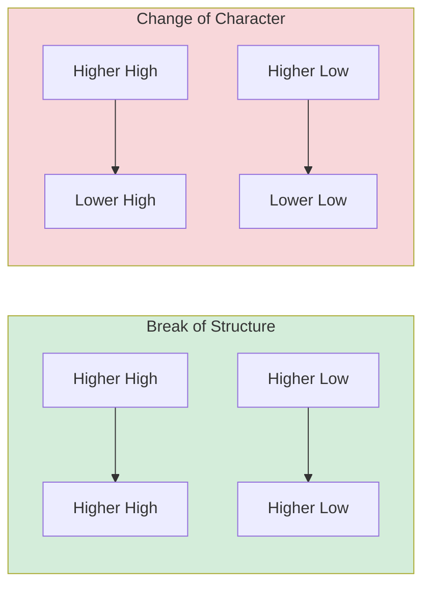
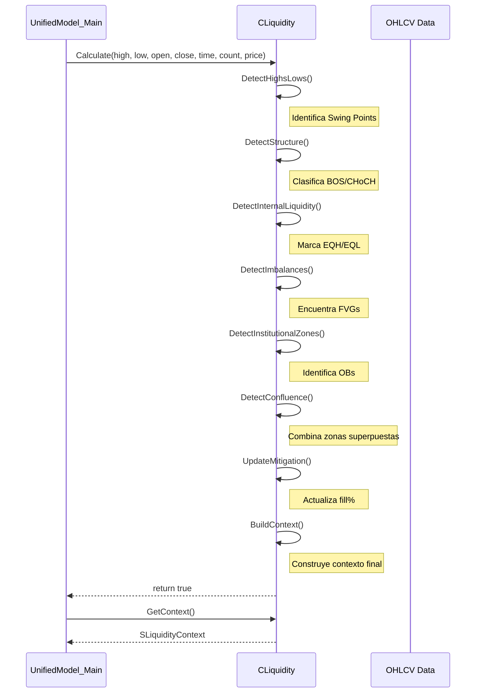

# 💧 Sistema de Mapeo de Liquidez Institucional

> **CLiquidity - Detección de Zonas POI y Estructura de Mercado**  
> *Lectura Causal del Precio Institucional*

---

## 🎯 Propósito

`CLiquidity.mqh` mapea el "campo de batalla" institucional, detectando:
- **Zonas de Liquidez** (highs/lows donde hay órdenes pendientes)
- **Imbalances** (FVG - Fair Value Gaps)
- **Zonas Institucionales** (Order Blocks, Zone Superpositions)
- **Estructura de Mercado** (BOS, CHoCH, Swings)

---

## 🏛️ Arquitectura de Detección

```mermaid
flowchart TB
    subgraph Input[📥 OHLCV Data]
        HLC[High/Low/Close Arrays]
        Time[Datetime Array]
    end
    
    subgraph CLiq[💧 CLiquidity Engine]
        HL[DetectHighsLows<br/>Swing Points]
        Str[DetectStructure<br/>BOS/CHoCH]
        Imb[DetectImbalances<br/>FVG/Gaps]
        Zones[DetectInstitutionalZones<br/>OB/ZS/PC]
        Conf[DetectConfluence<br/>Multi-Zone Overlap]
        Mit[UpdateMitigation<br/>Zone Fill%]
        Ctx[BuildContext<br/>Final Context]
    end
    
    subgraph Output[📤 Outputs]
        Levels[SLiquidityLevel[]]
        Imbalances[SImbalance[]]
        ZonesOut[SInstitutionalZone[]]
        Context[SLiquidityContext]
    end
    
    Input --> HL --> Str --> Imb --> Zones --> Conf --> Mit --> Ctx
    Ctx --> Output
```

---

## 📊 Tipos de Zonas

### 1. SLiquidityLevel - Niveles de Liquidez

Representa highs/lows significativos donde hay liquidez acumulada.

```mql5
struct SLiquidityLevel {
   double    price;           // Precio del nivel
   string    label;           // "EQH", "EQL", "PDH", "PDL", etc.
   int       touches;         // Número de toques
   double    strength;        // Fuerza del nivel (0-100)
   double    high, low;       // Rango del nivel
   double    midpoint;        // Punto medio
   datetime  time;            // Timestamp de creación
   bool      mitigated;       // ¿Ya fue mitigado?
   double    fillPercent;     // % de llenado
   bool      isBullish;       // Dirección de la liquidez
};
```

### Tipos de Niveles

| Label | Significado | Característica |
|-------|-------------|----------------|
| `EQH` | Equal Highs | Doble/triple techo |
| `EQL` | Equal Lows | Doble/triple piso |
| `PDH` | Previous Day High | Máximo del día anterior |
| `PDL` | Previous Day Low | Mínimo del día anterior |
| `PWH` | Previous Week High | Máximo de la semana anterior |
| `PWL` | Previous Week Low | Mínimo de la semana anterior |

---

### 2. SImbalance - Gaps de Valor Justo (FVG)

```mql5
struct SImbalance {
   double    top;             // Techo del gap
   double    bottom;          // Piso del gap
   double    midpoint;        // Punto medio (entrada óptima)
   datetime  time;            // Timestamp de formación
   bool      isBullish;       // ¿FVG alcista?
   double    size;            // Tamaño en ATRs
   double    fillPercent;     // % de llenado actual
};
```

### Detección de FVG

```
BULLISH FVG:
  Vela 1: [─────]       High1
  Vela 2: [═══════════] High2 (gap entre Low2 y High1)
  Vela 3: [─────]       Low3
                        
  FVG Zone = High1 → Low3

BEARISH FVG:
  Vela 1: [─────]       Low1
  Vela 2: [═══════════] Low2 (gap entre High2 y Low1)  
  Vela 3: [─────]       High3
                        
  FVG Zone = Low1 → High3
```

---

### 3. SInstitutionalZone - Zonas Institucionales

```mql5
enum ENUM_ZONE_TYPE {
   ZONE_FVG,          // Fair Value Gap
   ZONE_OB,           // Order Block
   ZONE_ZS,           // Zone Superposition
   ZONE_PC,           // Premium/Discount Zone
   ZONE_CONFLUENCE,   // Zona de confluencia múltiple
   ZONE_NONE
};

struct SInstitutionalZone {
   ENUM_ZONE_TYPE type;       // Tipo de zona
   double         top;        // Techo
   double         bottom;     // Piso
   datetime       time;       // Timestamp
   bool           isBullish;  // Dirección
   double         strength;   // Fuerza (0-100)
   double         fillPercent; // % mitigado
   string         label;      // "OB_H1", "FVG_M5", etc.
};
```

### Order Block (OB)

```
BULLISH ORDER BLOCK:
  ┌───────────────┐
  │   Vela Roja   │  ← Última vela bajista antes del movimiento
  │   (Demanda)   │
  └───────────────┘
        ↓
  ══════════════════  (Movimiento impulsivo alcista)
```

---

### 4. Estructura de Mercado

```mql5
enum ENUM_STRUCTURE_TYPE {
   STRUCT_NONE,
   STRUCT_BOS,       // Break of Structure (continuación)
   STRUCT_CHOCH      // Change of Character (reversión)
};

struct SStructureEvent {
   ENUM_STRUCTURE_TYPE type;
   bool      isBullish;
   double    price;
   datetime  time;
   int       barIndex;
   bool      active;
};
```

### BOS vs CHoCH



---

### 5. Swing Points

```mql5
enum ENUM_SWING_TYPE {
   SWING_NONE,
   SWING_HH,    // Higher High
   SWING_HL,    // Higher Low
   SWING_LH,    // Lower High
   SWING_LL    // Lower Low
};

struct SSwingPoint {
   ENUM_SWING_TYPE type;
   double    price;
   datetime  time;
   int       barIndex;
};
```

---

## 📦 Contexto de Liquidez (SLiquidityContext)

El resultado consolidado de todo el análisis:

```mql5
struct SLiquidityContext {
   // Niveles más cercanos
   SLiquidityLevel  nearestAbove;     // Próximo nivel arriba
   SLiquidityLevel  nearestBelow;     // Próximo nivel abajo
   int              totalAbove;       // Total de niveles arriba
   int              totalBelow;       // Total de niveles abajo
   
   // Equilibrium Analysis
   double           equilibrium;      // Punto de equilibrio calculado
   bool             isPremium;        // ¿Precio está en premium?
   bool             isDiscount;       // ¿Precio está en discount?
   
   // Nearest Imbalance
   SImbalance       nearestFVG;       // FVG más cercano
   
   // Estructura activa
   ENUM_STRUCTURE_TYPE structureTrend; // BOS o CHoCH activo
   bool             isBullishStructure;
};
```

---

## 🔌 API Pública

```mql5
class CLiquidity {
public:
   // Inicialización
   bool Init(string symbol, ENUM_TIMEFRAMES tf, 
             int maxLevels = 50, 
             int lookback = 100, 
             double equalPips = 5.0, 
             double fvgMinATR = 0.5);
   
   // Cálculo principal
   bool Calculate(const double &high[], const double &low[], 
                  const double &open[], const double &close[], 
                  const datetime &time[], int count, 
                  double currentPrice);
   
   // Getters de contexto
   SLiquidityContext GetContext();
   
   // Getters de elementos específicos
   bool GetNearestLevel(double price, ENUM_LIQUIDITY_SIDE side, SLiquidityLevel &level);
   bool GetNearestImbalance(double price, ENUM_LIQUIDITY_SIDE side, SImbalance &imb);
   
   // Contadores de estructura
   int GetStructureCount();
   SStructureEvent GetStructureEvent(int index);
   int GetSwingCount();
   SSwingPoint GetSwingPoint(int index);
};
```

---

## 🎯 Flujo de Detección



---

## 📐 Parámetros de Configuración

| Parámetro | Default | Descripción |
|-----------|---------|-------------|
| `maxLevels` | 50 | Máximo de niveles a trackear |
| `lookback` | 100 | Barras de historia a analizar |
| `equalPips` | 5.0 | Tolerancia para EQH/EQL (en pips) |
| `fvgMinATR` | 0.5 | Tamaño mínimo de FVG (en ATRs) |

---

## 💡 Uso en CFEAT

CFEAT utiliza CLiquidity para:

1. **Táctica Espacial**: Determinar si el precio está en una zona POI
2. **Target Mapping**: Calcular el próximo objetivo (nearestAbove/Below)
3. **Confirmación de Setup**: Validar que hay liquidez en dirección del trade
4. **Risk Management**: Colocar SL detrás de zonas de liquidez

```mql5
// Ejemplo de uso en CFEAT::RunTactician
SLiquidityContext ctx = m_ptrLiq.GetContext();

if(ctx.nearestFVG.fillPercent < 0.5) {
   // FVG sin mitigar → posible entrada
   m_tactician.poiDetected = "FVG_M5";
   m_tactician.action = "BUSCAR_GATILLO";
}
```

---

## ⚠️ Consideraciones

> [!WARNING]
> La detección de FVG tiene un tamaño mínimo de 0.5 ATR para evitar ruido.
> FVGs muy pequeños son filtrados automáticamente.

> [!TIP]
> Usa `GetContext().isPremium` para determinar si buscar ventas, 
> y `isDiscount` para buscar compras.

> [!NOTE]
> Las zonas con `fillPercent > 0.8` se consideran mitigadas y tienen menor prioridad.

---

*Módulo: CLiquidity*
*Versión: 2.0*
