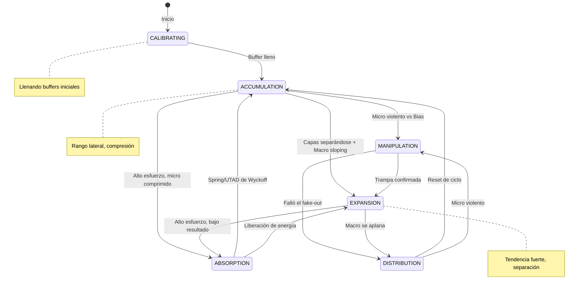

# ⚙️ Máquina de Estados Finitos (FSM)

> **CFSM - Clasificador de Estados de Mercado**  
> *Wyckoff-Inspired Market Phase Detection*

---

## 🎯 Propósito

`CFSM.mqh` clasifica el estado actual del mercado en **6 fases discretas** basadas en la metodología Wyckoff, utilizando el comportamiento de las capas EMA y el análisis Esfuerzo/Resultado.

---

## 🔄 Diagrama de Estados



---

## 📊 Estados del Mercado

### 1. CALIBRATING (Calibrando)
```
Estado: Sistema llenando buffers iniciales
Duración: Primeras ~100 barras
Acción: No operar
```

### 2. ACCUMULATION (Acumulación)
```
Características:
├── Micro: Comprimido (compression > 0.7)
├── Precio: Dentro de la nube operacional
├── Volumen: Normal o bajo
└── Wyckoff: Fase A-B (Range Building)

Señales:
- Capas EMA muy juntas
- Movimiento lateral
- Preparación para breakout
```

### 3. EXPANSION (Expansión)
```
Características:
├── Capas: Separándose (sep > 2.0 ATR)
├── Macro: Pendiente significativa (slope > 0.2)
├── Volumen: Alto
└── Wyckoff: Fase D (Markup/Markdown)

Señales:
- Abanico EMA abierto
- Tendencia clara
- Momentum fuerte
```

### 4. DISTRIBUTION (Distribución)
```
Características:
├── Macro: Plano (slope < 0.1)
├── Micro: Caótico (spread > 5 ATR)
├── Volumen: Elevado pero errático
└── Wyckoff: Fase E (Distribution top)

Señales:
- Pérdida de momentum
- Capas convergiendo
- Posible reversión
```

### 5. MANIPULATION (Manipulación)
```
Características:
├── Micro: Violento (slope > 1.0)
├── Dirección: Contra el Bias
├── Volumen: Spike
└── Wyckoff: Spring/UTAD

Señales:
- Falso breakout
- Stop hunting
- Captura de liquidez
```

### 6. ABSORPTION (Absorción)
```
Características:
├── Esfuerzo: Alto (effort > 1.5)
├── Resultado: Bajo (micro comprimido)
├── Volumen: Muy alto
└── Wyckoff: Test/Re-accumulation

Señales:
- Volumen sin movimiento de precio
- Institucionales acumulando
- Preparación para impulso
```

---

## 🧮 Lógica de Clasificación

### Métricas de Entrada

```mql5
// Del Motor de EMAs (CEMAs)
SEMAGroupMetrics micro = m_ptrEmas.GetMicroMetrics();
SEMAGroupMetrics oper  = m_ptrEmas.GetOperationalMetrics();
SEMAGroupMetrics macro = m_ptrEmas.GetMacroMetrics();
SEMAGroupMetrics bias  = m_ptrEmas.GetBiasMetrics();

// Calculados localmente
double effort = volume / (atr * 100000);  // Esfuerzo normalizado
double result = MathAbs(close - prevClose) / atr;  // Resultado normalizado
double sep = MathAbs(micro.avgValue - oper.avgValue) / atr;  // Separación
```

### Preguntas de Capa (Layer Questions)

```mermaid
flowchart TD
    Q1{¿Micro comprimido?<br/>compression > 0.7}
    Q2{¿Precio en Oper?<br/>position ∈ [-0.5, 0.5]}
    Q3{¿Macro sloping?<br/>|slope| > 0.2}
    Q4{¿Capas separándose?<br/>sep > 2.0 ATR}
    Q5{¿Effort alto?<br/>effort > 1.5}
    Q6{¿Micro violento?<br/>|slope| > 1.0}
    Q7{¿Contra Bias?<br/>micro.slope × bias.slope < 0}
    
    Q1 -->|Sí| Q5
    Q1 -->|No| Q4
    Q5 -->|Sí| ABSORPTION
    Q5 -->|No| Q2
    Q2 -->|Sí| ACCUMULATION
    Q4 -->|Sí| Q3
    Q3 -->|Sí| EXPANSION
    Q3 -->|No| Q6
    Q6 -->|Sí| Q7
    Q7 -->|Sí| MANIPULATION
    Q7 -->|No| DISTRIBUTION
```

### Código de Clasificación

```mql5
bool CFSM::Calculate(double close, double prevClose, double volume) {
   // ... cálculo de effort, result, etc ...
   
   ENUM_MARKET_STATE newState = m_state;
   
   // ABSORPTION: Alto Esfuerzo + Micro Comprimido (Wyckoff)
   if(effort > 1.5 && microCompressed) 
      newState = STATE_ABSORPTION;
   
   // MANIPULATION: Micro violento cruza contra Bias
   else if(MathAbs(micro.avgSlope) > 1.0 && (micro.avgSlope * bias.avgSlope < 0)) 
      newState = STATE_MANIPULATION;
   
   // EXPANSION: Capas separándose + Macro sloping
   else if(separating && macroSloping) 
      newState = STATE_EXPANSION;
   
   // ACCUMULATION: Micro comprimido + Precio en nube Operational
   else if(microCompressed && priceInOper) 
      newState = STATE_ACCUMULATION;
   
   // DISTRIBUTION: Macro plano + Micro caótico
   else if(MathAbs(macro.avgSlope) < 0.1 && micro.spread > atr * 5) 
      newState = STATE_DISTRIBUTION;
   
   // Actualizar estado
   if(newState != m_state) {
      m_state = newState;
      m_barsInState = 0;
   } else {
      m_barsInState++;
   }
   
   return true;
}
```

---

## 📈 Métricas FSM (SFSMMetrics)

```mql5
struct SFSMMetrics {
   double effort;       // Esfuerzo (volumen normalizado)
   double result;       // Resultado (movimiento de precio)
   double compression;  // Compresión de la capa Micro
   double slope;        // Pendiente de la capa Operational
   double speed;        // Velocidad (gap Micro-Oper / ATR)
};
```

### Interpretación de Métricas

| Métrica | Valor Bajo | Valor Alto |
|---------|------------|------------|
| `effort` | < 0.5 (poco volumen) | > 1.5 (mucho volumen) |
| `result` | < 0.3 (poco movimiento) | > 1.0 (gran movimiento) |
| `compression` | < 0.3 (expandido) | > 0.7 (comprimido) |
| `slope` | ~ 0 (lateral) | > 0.5 (tendencia) |
| `speed` | < 1.0 (lento) | > 3.0 (rápido) |

---

## 🔄 Ciclo de Wyckoff

El FSM sigue el ciclo clásico de Wyckoff:

```
┌─────────────────────────────────────────────────────────┐
│                     CICLO DE WYCKOFF                    │
├─────────────────────────────────────────────────────────┤
│                                                         │
│   ACUMULACIÓN ──→ MARKUP ──→ DISTRIBUCIÓN ──→ MARKDOWN │
│        ↑                            │                  │
│        └────────────────────────────┘                  │
│                                                         │
│   FSM Mapping:                                          │
│   ├── ACCUMULATION = Acumulación / Re-acumulación       │
│   ├── ABSORPTION   = Testing (Spring/UTAD)              │
│   ├── MANIPULATION = False Breakout / Shakeout          │
│   ├── EXPANSION    = Markup / Markdown                  │
│   └── DISTRIBUTION = Distribución / Re-distribución     │
│                                                         │
└─────────────────────────────────────────────────────────┘
```

---

## 🎯 Uso en Trading

### Estados vs Acciones Sugeridas

| Estado | Acción Óptima |
|--------|---------------|
| **CALIBRATING** | ❌ No operar - Sistema arrancando |
| **ACCUMULATION** | 👀 Observar - Esperar confirmación de dirección |
| **ABSORPTION** | ⚡ Prepararse - Posible entrada inminente |
| **MANIPULATION** | 🎯 Oportunidad - Entrar en dirección opuesta al fake-out |
| **EXPANSION** | 🏃 Seguir - Buscar continuación de tendencia |
| **DISTRIBUTION** | 🚪 Salir - Cerrar posiciones, no abrir nuevas |

---

## 🔌 API Pública

```mql5
class CFSM {
public:
   // Configuración
   void SetComponents(CEMAs* emas, CFEAT* feat, CLiquidity* liq);
   void SetBufferSize(int size);  // Default: 100
   
   // Cálculo
   bool Calculate(double close, double prevClose, double volume);
   
   // Getters
   ENUM_MARKET_STATE GetState() const;
   string GetStateString() const;
   double GetConfidence() const;
   SFSMMetrics GetMetrics();
   int GetBarsInState() const;
};
```

---

## 📊 Integración con ML

El FSM exporta datos para el entrenamiento de modelos:

```python
# Exportado via CInterop a CSV:
# effort, result, compression, slope, speed, marketState

# El pipeline Python entrena un clasificador:
from sklearn.ensemble import RandomForestClassifier

clf = RandomForestClassifier()
clf.fit(X_train, y_train)  # y = marketState

# El modelo entrenado se guarda en:
# Python/fsm_model.joblib
```

> [!TIP]
> El archivo `Python/optuna_optimizer.py` calibra los umbrales óptimos para la clasificación FSM usando Bayesian Search.

---

## ⚠️ Limitaciones

> [!WARNING]
> La confianza actual es un placeholder (`m_confidence = 70.0`).  
> En producción, esto debería venir del modelo ML.

> [!NOTE]
> El FSM requiere al menos 100 barras de datos para salir de CALIBRATING.
> Esto es configurable con `SetBufferSize()`.

---

*Módulo: CFSM*
*Versión: 2.0*
