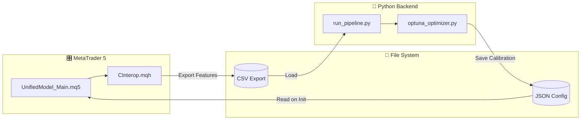
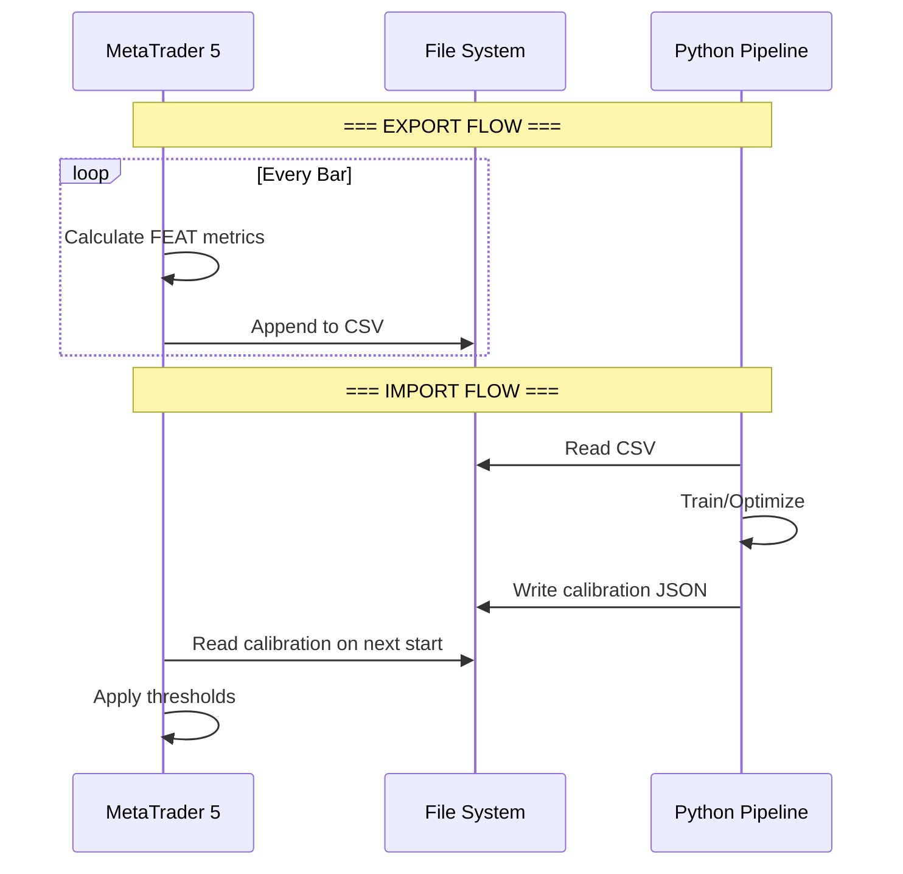

# 🔗 Interoperabilidad MT5 ↔ Python

> **CInterop & Bridge System**  
> *Exportación de Features y Calibración Bidireccional*

---

## 🎯 Propósito

La interoperabilidad permite:
1. **MT5 → Python**: Exportar features en tiempo real a CSV
2. **Python → MT5**: Importar calibraciones optimizadas
3. **Bridge HTTP**: Comunicación en vivo (opcional)

---

## 🏛️ Arquitectura



---

## 📤 Export: MT5 → Python

### CInterop.mqh - Exportador de Features

```mql5
class CInterop {
   bool   m_enabled;
   string m_path;
   string m_filename;
   bool   m_headerWritten;
   
public:
   void SetEnabled(bool e);
   void SetDataPath(string p);
   void SetFilename(string f);
   bool ExportFeatures(SBarDataExport &data);
};
```

### Estructura de Datos Exportados

```mql5
struct SBarDataExport {
   // === OHLCV ===
   datetime time;
   double   open, high, low, close, volume;
   
   // === EMA Layer Metrics ===
   double   microComp, microSlope, microCurvature;
   double   operComp, operSlope;
   double   macroSlope, biasSlope;
   double   compression, fanAlignment;
   
   // === FSM Metrics ===
   double   effort, result;
   double   fsmSpeed;
   string   marketState;
   double   stateConfidence;
   
   // === FEAT Form ===
   bool     hasBOS, hasCHoCH, hasHCH;
   bool     isIntentCandle;
   double   curvatureScore;
   double   compressionRatio;
   
   // === FEAT Space ===
   bool     atZone;
   double   proximityScore;
   string   activeZoneType;
   
   // === FEAT Acceleration ===
   double   rsiValue;
   double   macdHistogram;
   double   momentum;
   double   velocity;
   double   acceleration;
   
   // === FEAT Time ===
   bool     isKillzone;
   string   activeSession;
   
   // === FEAT Composite ===
   double   compositeScore;
   
   // === Multitemporal ===
   string   dominantTrend;
   int      mtfConfluence;
   bool     mtfAgainstBias;
   double   m5Bias, h1Bias, h4Bias, d1Bias;
};
```

### Formato CSV de Salida

```csv
time,open,high,low,close,volume,microComp,microSlope,microCurvature,operComp,operSlope,macroSlope,biasSlope,compression,fanAlignment,effort,result,fsmSpeed,hasBOS,hasCHoCH,hasHCH,isIntentCandle,curvatureScore,compressionRatio,atZone,proximityScore,activeZoneType,rsiValue,macdHistogram,momentum,velocity,acceleration,isKillzone,activeSession,marketState,compositeScore,dominantTrend,mtfConfluence,mtfAgainstBias,m5Bias,h1Bias,h4Bias,d1Bias
2025.01.09 08:00,1.08234,1.08456,1.08123,1.08345,12345,0.65,0.23,0.12,0.45,0.18,0.32,-0.05,0.72,BULLISH,1.23,0.45,2.1,1,0,0,1,0.67,0.72,1,0.85,FVG_M5,58.3,0.0012,0.34,0.28,0.06,1,LONDON,ACCUMULATION,72.5,BULLISH,3,0,0.45,0.32,0.28,0.15
```

### Ubicación del Archivo

```
MT5 Common Files Directory/
└── UnifiedModel_LiveFeed.csv
```

> [!NOTE]
> El directorio común de MT5 es típicamente:
> `C:\Users\<user>\AppData\Roaming\MetaQuotes\Terminal\Common\Files\`

---

## 📥 Import: Python → MT5

### optuna_calibration.json

```json
{
  "metadata": {
    "symbol": "EURUSD",
    "timeframe": "H1",
    "optimization_method": "optuna",
    "trials": 100,
    "timestamp": "2025-01-09T08:00:00Z"
  },
  "best_score": 0.847,
  "thresholds": {
    "effort_p20": 0.32,
    "effort_p80": 1.45,
    "result_p20": 0.28,
    "result_p80": 0.92,
    "layer_sep": 2.1,
    "bias_slope": 0.25,
    "compression_threshold": 0.7,
    "micro_violence_threshold": 1.0
  },
  "state_priors": {
    "ACCUMULATION": 0.35,
    "EXPANSION": 0.25,
    "DISTRIBUTION": 0.15,
    "MANIPULATION": 0.10,
    "ABSORPTION": 0.15
  }
}
```

### Lectura en MQL5 (Propuesta)

```mql5
// Pseudocódigo para lectura de calibración
bool LoadCalibration(string filepath, SCalibration &cal) {
   int handle = FileOpen(filepath, FILE_READ|FILE_TXT);
   if(handle == INVALID_HANDLE) return false;
   
   string json = "";
   while(!FileIsEnding(handle)) {
      json += FileReadString(handle);
   }
   FileClose(handle);
   
   // Parse JSON (requiere biblioteca externa o parser manual)
   // cal.effortP20 = ParseJsonDouble(json, "effort_p20");
   // ...
   
   return true;
}
```

---

## 🌉 Bridge HTTP (Opcional)

### institutional_bridge.py

Para comunicación en tiempo real bidireccional:

```python
from flask import Flask, request, jsonify

app = Flask(__name__)

@app.route('/api/state', methods=['POST'])
def receive_state():
    """Recibe estado actual de MT5."""
    data = request.json
    db.log_state(
        symbol=data['symbol'],
        state=data['state'],
        metrics=data['metrics']
    )
    return jsonify({"status": "ok"})

@app.route('/api/calibration', methods=['GET'])
def get_calibration():
    """Devuelve calibración activa."""
    cal = db.get_active_calibration(
        request.args.get('symbol'),
        request.args.get('timeframe')
    )
    return jsonify(cal)

@app.route('/api/predict', methods=['POST'])
def predict_state():
    """Predicción de estado con modelo ML."""
    features = request.json['features']
    prediction = classifier.predict([features])
    return jsonify({"state": prediction[0]})

if __name__ == '__main__':
    app.run(host='127.0.0.1', port=8888)
```

### bridge_config.json

```json
{
  "host": "127.0.0.1",
  "port": 8888,
  "db_path": "unified_model.db",
  "export_path": "../",
  "log_level": "INFO",
  "endpoints": {
    "state": "/api/state",
    "calibration": "/api/calibration",
    "predict": "/api/predict"
  }
}
```

### start_bridge.bat

```batch
@echo off
cd /d "%~dp0"
python institutional_bridge.py
pause
```

---

## 🔄 Flujo de Sincronización



---

## 📊 Mapeo de Columnas CSV

| Columna CSV | Fuente MQL5 | Tipo Python |
|-------------|-------------|-------------|
| `time` | `data.time` | `datetime` |
| `open/high/low/close` | OHLC array | `float` |
| `volume` | `tick[]` | `int` |
| `microComp` | `micro.compression` | `float` |
| `microSlope` | `micro.avgSlope` | `float` |
| `effort` | `fsm.effort` | `float` |
| `result` | `fsm.result` | `float` |
| `marketState` | `fsm.GetStateString()` | `str` |
| `compositeScore` | `feat.confidence` | `float` |
| `dominantTrend` | `mtf.dominantTrend` | `str` |

---

## ⚙️ Configuración en MT5

### En UnifiedModel_Main.mq5

```mql5
input bool ExportData = true;    // Export Data for Neural Training

// En OnInit():
g_io.SetEnabled(ExportData);
g_io.SetDataPath("");  // Usa directorio común
g_io.SetFilename("UnifiedModel_LiveFeed.csv");

// En OnCalculate():
if(ExportData) {
   SBarDataExport data;
   // ... llenar estructura data ...
   g_io.ExportFeatures(data);
}
```

---

## 🔒 Consideraciones de Seguridad

> [!WARNING]
> El bridge HTTP solo debe escuchar en `127.0.0.1` (localhost).
> Nunca exponer el puerto a la red externa.

> [!CAUTION]
> Los archivos CSV pueden crecer rápidamente.
> Implementar rotación de logs o limpieza periódica.

---

## 📈 Performance

| Operación | Tiempo Típico |
|-----------|---------------|
| Export 1 barra a CSV | < 1ms |
| Load CSV (10k rows) | ~200ms |
| Optuna optimization (100 trials) | ~30s |
| Generate dashboard | ~5s |

---

*Módulo: Interoperabilidad*  
*Versión: 2.0*
