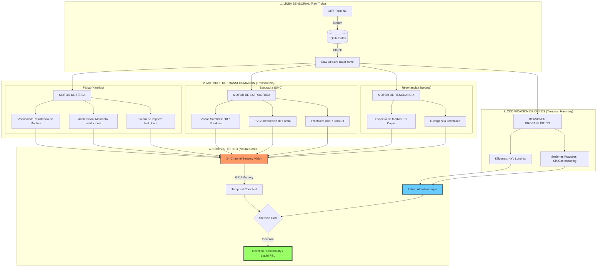

# 🗺️ V6 SYSTEM_MAP: Neural Information Flow

This map represents the dynamic routing of market signals within the **Titanium V6 "God Mode"** architecture.

---

## ⚡ Enfoque del Córtex Híbrido
*   **TCN Body:** Procesa la memoria temporal profunda de los 24 canales institucionales.
*   **Attention Layer:** Decide, basándose en los **Ciclos Fractales**, si los canales de Física o Estructura son prioritarios en el milisegundo actual.
