# 🗺️ V6 SYSTEM_MAP: Neural Information Flow

This map represents the dynamic routing of market signals within the **Titanium V6 "God Mode"** architecture.

```mermaid
graph TD
    subgraph "1. LÍNEA SENSORIAL (Raw Ticks)"
        MT5[MT5 Terminal] -->|Stream| SQL[(SQLite Buffer)]
        SQL -->|Chunk| RAW[Raw OHLCV DataFrame]
    end

    subgraph "2. MOTORES DE TRANSFORMACIÓN (Transmuters)"
        RAW --> PHYS[MOTOR DE FÍSICA]
        RAW --> STRUCT[MOTOR DE ESTRUCTURA]
        RAW --> RESO[MOTOR DE RESONANCIA]

        subgraph "Física (Kinetics)"
            PHYS --> FIS1[Viscosidad: Resistencia de Mechas]
            PHYS --> FIS2[Aceleración: Momento Institucional]
            PHYS --> FIS3[Fuerza de Impacto: feat_force]
        end

        subgraph "Estructura (SMC)"
            STRUCT --> SMC1[Zonas Sombras: OB / Breakers]
            STRUCT --> SMC2[FVG: Ineficiencia de Precio]
            STRUCT --> SMC3[Fractales: BOS / CHoCH]
        end

        subgraph "Resonancia (Spectral)"
            RESO --> SPEC1[Espectro de Medias: 10 Capas]
            RESO --> SPEC2[Divergencia Cromática]
        end
    end

    subgraph "3. CODIFICACIÓN DE CICLOS (Temporal Harmony)"
        RAW --> TIME[REASONER PROBABILÍSTICO]
        TIME --> CYCLE1[Killzones: NY / Londres]
        TIME --> CYCLE2[Sesiones Fractales: Sin/Cos encoding]
    end

    subgraph "4. CÓRTEX HÍBRIDO (Neural Core)"
        FIS1 & FIS2 & FIS3 & SMC1 & SMC2 & SMC3 & SPEC1 & SPEC2 --> VISION[24-Channel Sensory Vision]
        CYCLE1 & CYCLE2 --> ATTN[Latent Attention Layer]
        
        VISION --> |GRU Memory| TCN[Temporal Conv Net]
        TCN --> ATN_GATE{Attention Gate}
        ATTN --> ATN_GATE
        ATN_GATE --> |Decision| OUT[Direction / Uncertainty / Liquid P&L]
    end

    style VISION fill:#f96,stroke:#333,stroke-width:2px
    style ATTN fill:#6cf,stroke:#333,stroke-width:2px
    style OUT fill:#9f6,stroke:#333,stroke-width:4px
```

---

## ⚡ Enfoque del Córtex Híbrido
*   **TCN Body:** Procesa la memoria temporal profunda de los 24 canales institucionales.
*   **Attention Layer:** Decide, basándose en los **Ciclos Fractales**, si los canales de Física o Estructura son prioritarios en el milisegundo actual.
