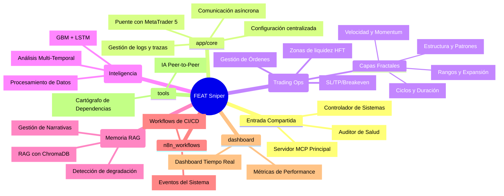

# 🗺️ FEAT Sniper: Mapa Mental del Proyecto

Este documento proporciona una visión jerárquica y detallada de la arquitectura de FEAT Sniper MCP, analizando cada módulo, carpeta y archivo clave.

## 📊 Visualización de Arquitectura (Mermaid)

---

## 📂 Desglose Detallado de Módulos

### 🚀 Entrada y Control (Root)
| Archivo | Propósito |
| :--- | :--- |
| `mcp_server.py` | Punto de entrada para el protocolo MCP, expone las 10 Master Tools. |
| `nexus_control.py` | Coordinador de procesos, gestiona el ciclo de vida de los servicios. |
| `nexus_auditor.py` | Verifica dependencias, puertos, salud de Docker y MT5. |
| `nexus.bat` | Script de arranque unificado del sistema. |

### 🛠️ Núcleo del Sistema (`app/core`)
| Archivo | Propósito |
| :--- | :--- |
| `logger.py` | Implementa filtrado de recursividad y logging estructurado. |
| `config.py` | Gestiona variables de entorno y constantes del sistema. |
| `mt5_conn.py` | Handler de la conexión nativa con MetaTrader 5. |
| `zmq_bridge.py` | Bridge para comunicación inter-proceso de alta velocidad. |

### 🎯 Habilidades de Trading (`app/skills`)
| Archivo | Propósito |
| :--- | :--- |
| `feat_tiempo.py` | **Capa 1**: Analiza la duración de los movimientos y ciclos de mercado. |
| `feat_forma.py` | **Capa 2**: Identifica patrones geométricos y quiebres de estructura. |
| `feat_espacio.py` | **Capa 3**: Mide la expansión del precio y objetivos de Fibonacci. |
| `feat_aceleracion.py` | **Capa 4**: Detecta clímax y cambios bruscos en la volatilidad. |
| `liquidity_detector.py` | Identifica "Value Areas" y zonas donde reside la liquidez institucional. |
| `execution.py`| Realiza el envío físico de órdenes y validación de lotaje. |
| `trade_mgmt.py` | Gestiona el trailing stop y el riesgo de posiciones abiertas. |

### 🧠 Inteligencia Artificial (`app/ml`)
| Archivo | Propósito |
| :--- | :--- |
| `ml_engine.py` | Coordina las predicciones de los modelos híbridos. |
| `multi_time_learning.py` | Sincroniza predicciones entre diferentes marcos temporales (H1, M15, M1). |
| `feat_processor.py` | Transforma datos brutos de MT5 en tensores para los modelos. |
| `train_models.py` | Pipeline de entrenamiento automático basado en datos históricos. |

### 📂 Gestión de Memoria (`brain_core`)
| Archivo | Propósito |
| :--- | :--- |
| `feat_memory_mcp.py` | Implementa el almacenamiento RAG para "recuerdo" de trades pasados. |
| `db_engine.py` | Gestiona la persistencia de datos en bases de datos relacionales y vectoriales. |
| `drift_monitor.py` | Alerta si el modelo deja de ser efectivo debido a cambios en el mercado. |

---

> [!NOTE]
> Este mapa se genera dinámicamente analizando la arquitectura actual del proyecto FEAT Sniper MCP.